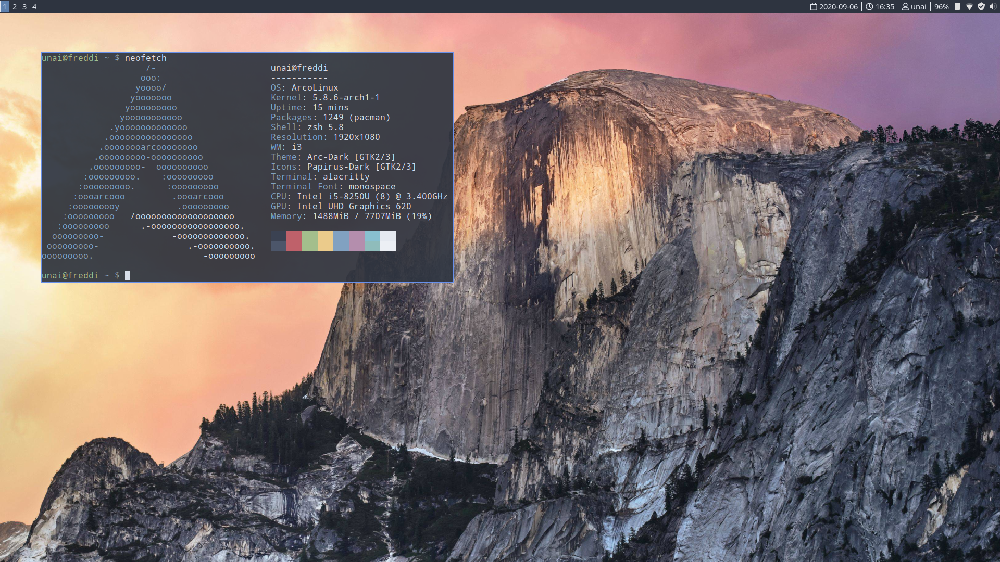

# dotfiles

My linux configurations and dotfiles.

| Purpose          | Tool                                                                   |
| ---------------- | ---------------------------------------------------------------------- |
| WM               | i3 (i3-gaps)                                                           |
| App launcher     | rofi                                                                   |
| Shell            | zsh                                                                   |
| Package managers | Pacman                                                        |
| OS               | Arco Linux                                                             |
| Terminal         | Alacritty                                                         |
| Editor           | Neovim                                                                   |
| Browser          | Brave                                                               |
| File manager     | Thunar                                      |
|                  |                                                                        |

